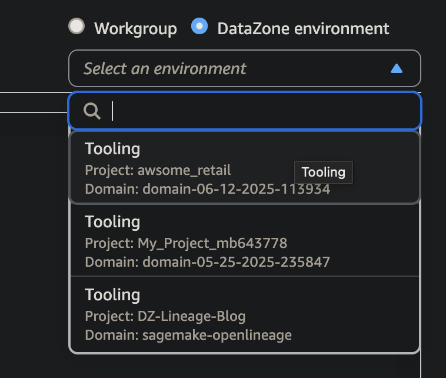
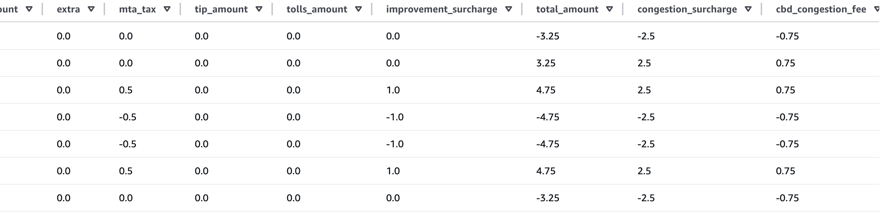

# nyc-taxi-demand-forecast

```bash
aws configure sso --profile sandbox
```

```bash
bash run.sh cdk_bootstrap
```

```bash
bash run.sh cdk_deploy
```


## Notes

Arriving at DDL is HARD. At the end of the day YOU have to decide what values you are willing to accept
into a table.

I took this DDL statement [from the DE Zoomcamp](https://github.com/DataTalksClub/data-engineering-zoomcamp/blob/main/02-workflow-orchestration/flows/02_postgres_taxi.yaml#L75)

```sql
CREATE TABLE IF NOT EXISTS raw_yellow (
    unique_row_id          text,
    filename               text,
    VendorID               text,
    tpep_pickup_datetime   timestamp,
    tpep_dropoff_datetime  timestamp,
    passenger_count        integer,
    trip_distance          double precision,
    RatecodeID             text,
    store_and_fwd_flag     text,
    PULocationID           text,
    DOLocationID           text,
    payment_type           integer,
    fare_amount            double precision,
    extra                  double precision,
    mta_tax                double precision,
    tip_amount             double precision,
    tolls_amount           double precision,
    improvement_surcharge  double precision,
    total_amount           double precision,
    congestion_surcharge   double precision
);
```

But when I tried to upsert the first parquet file I got this error:

```python
[1750444045333209/upsert_yellow_taxi_data/4 (pid 26702)] Error processing 2025-01.parquet: Schema change detected:
{'new_columns': {'cbd_congestion_fee': 'double', 'airport_fee': 'double'}, 'modified_columns': {'passenger_count': 'double', 'vendorid': 'int', 'payment_type': 'bigint', 'pulocationid': 'int', 'ratecodeid': 'double', 'dolocationid': 'int'}, 'missing_columns': {}}
```

Keep in mind, this example DDL is for Postgres and mine is for Athena/Iceberg. I'm not sure if that was the issue.

Note that `unique_row_id text,` is not a column that comes with the NYC taxi dataset.

The DE Zoomcamp folks created that column [like this](https://github.com/DataTalksClub/data-engineering-zoomcamp/blob/main/02-workflow-orchestration/flows/02_postgres_taxi.yaml#L119C11-L130C48):

```sql
UPDATE {{render(vars.staging_table)}}
SET 
unique_row_id = md5(
    COALESCE(CAST(VendorID AS text), '') ||
    COALESCE(CAST(tpep_pickup_datetime AS text), '') || 
    COALESCE(CAST(tpep_dropoff_datetime AS text), '') || 
    COALESCE(PULocationID, '') || 
    COALESCE(DOLocationID, '') || 
    COALESCE(CAST(fare_amount AS text), '') || 
    COALESCE(CAST(trip_distance AS text), '')      
),
filename = '{{render(vars.file)}}';
```

I thought that was a good idea. It hearkens back to Jose Navarro's comment: the first thing you should
do in any EDA is identify "by what combination of columns are these rows unique?"

This is essentially doing that, and then assigning a unique hash to the rows.

And it worked!

```log
2025-06-20 12:43:54.735 [1750444930482555/upsert_yellow_taxi_data/4 (pid 37456)] Processing file: 2025-01.parquet
2025-06-20 12:43:54.736 [1750444930482555/upsert_yellow_taxi_data/4 (pid 37456)] Successfully upserted 3475226 records from 2025-01.parquet
```

But then on the next 2 files (I was only doing 3 files total so this happened on ALL the subsequent files)

```log
2025-06-20 12:45:11.572 [1750444930482555/upsert_yellow_taxi_data/4 (pid 37456)] Processing file: 2025-02.parquet
2025-06-20 12:45:11.572 [1750444930482555/upsert_yellow_taxi_data/4 (pid 37456)] Error processing 2025-02.parquet: MERGE_TARGET_ROW_MULTIPLE_MATCHES: One MERGE target table row matched more than one source row
2025-06-20 12:46:34.217 [1750444930482555/upsert_yellow_taxi_data/4 (pid 37456)] Processing file: 2025-03.parquet
2025-06-20 12:46:34.219 [1750444930482555/upsert_yellow_taxi_data/4 (pid 37456)] Error processing 2025-03.parquet: MERGE_TARGET_ROW_MULTIPLE_MATCHES: One MERGE target table row matched more than one source row
```

Annoying :/

Maybe my "unique IDs" aren't so unique. 

Maybe that's because I'm doing the calculation of the ID wrong... or maybe there are a lot of NULLs in the parquet files.

EDA time.



**WAP**

I created this function to create unique IDs and ran the pipeline on 3 months of data.

```python
hashed_columns = ['VendorID', 'tpep_pickup_datetime', 'tpep_dropoff_datetime',
                    'PULocationID', 'DOLocationID', 'fare_amount', 'trip_distance']
df['unique_row_id'] = fast_md5_hash(df, hashed_columns=hashed_columns)
```

Then I ran this query to pull up any rows that had duplicate `unique_row_id`s.

```sql
SELECT *
FROM "AwsDataCatalog"."nyc_taxi"."raw_yellow"
WHERE unique_row_id IN (
  SELECT unique_row_id
  FROM "AwsDataCatalog"."nyc_taxi"."raw_yellow"
  GROUP BY unique_row_id
  HAVING COUNT(*) > 1
);
```

There were more than 2000 rows that did :(

There were PAIRS of rows that were identical except that all the charges were negative. I wonder if this was for a refund or something. I should have included some of these column names in my
hash function--or simply not created a unique id and instead merged on all columns.



Write-audit-publish would have prevented this. 

My IDs weren't unique enough because
even with all the fields I hashed, total_amount was still different between
otherwise *completely identical rows*. 

If I had done a WAP, I could have
run a query to assert that the incoming parquet file's `unique_row_id`'s were
ACTUALLY unique when compared to the entire existing table. That could be done
on a branch and then rejected if the IDs were not unique.

**Debugging**

I **really** should add an `ingest_timestamp` column to the dataset.

Otherwise, if you get something wrong, how on earth would you discover which rows
you need to delete out of the table!

<!-- 

What hiring managers want to see:

1. I think in terms in value
2. I can write good code
3. I can build systems
4. I can reason about issues in data: class imbalance, metrics, holdouts, evaluations. -->
