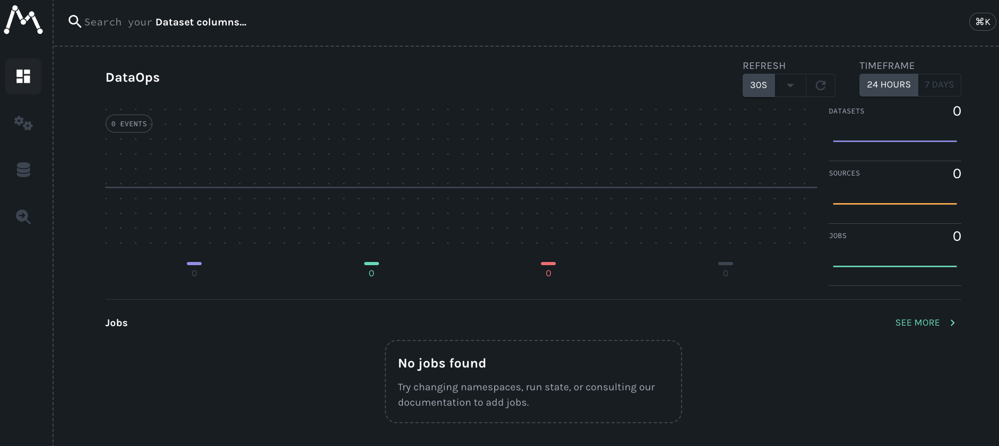

# OpenLineage

I want to get openlineage data into AWS DataZone from Python.

But I'm using Marquez as an OL backend first, to get it working locally,
since trying to log OL data to AWS out of the gate would confound the learning curve of OL.

I followed the marquez tutorial [here](https://openlineage.io/docs/guides/airflow-quickstart/#get-marquez).

To start up a marquez server, do

```bash
cd ./marquez
bash ./docker/up.sh --db-port 12345 --api-port 9000 --no-volumes --seed
```

Then go to http://localhost:3000 to see the UI

